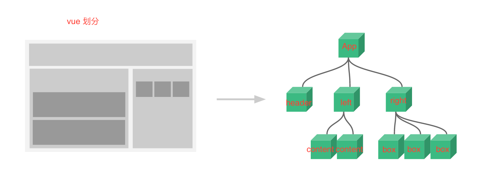

#$\color{red}{Vue}$

<!-- <font color=#0099ff size=7 face="黑体">Vue</font> -->

### Vue 简介

- 属于单页面应用（SPA）

#### 如何开始一个 vue 项目

- vue 开发的模式都是属于 node 项目开发模式，由于 vue 框架本身非常复杂，需要各种工具包，需要搭建一个 vue 的开发环境。但是手动搭建一个 vue 的开发环境非常难，但是官方提供了一个非常不错的脚手架（cli）

- 安装脚手架工具 cli 在命令行执行 `npm install -g @vue/cli` 全局脚手架工具

- 利用脚手架工具搭建 vue 项目
- 直接使用命令搭建，在对应位置打开命令行工具，执行`vue create vue-hello` 命令创建项目，选择默认预设，然后直接回车即可
- 使用图形化界面搭建（只有脚手架工具 3.x 以上版本才能使用），在对应位置打开命令行工具，执行 `vue ui` 命令，会在浏览器中自动弹出图形化界面，可以创建新的项目了
- 运行已经创建好的项目，其实就是执行项目下的 package.json 文件内的 script 字段下的 serve 命令 `vue run serve` 这个命令执行完毕之后，默认的就会将 vue 的 demo 项目启动在本机（localhost）服务器下的 8080 端口，有冲突则会向下顺延端口
- 图形化 ui 则是点击运行 -> 启动 app
  

#### vue 项目默认的目录结构

- node_modules 所有的基础依赖，以后通过 npm 下载的所有的包也会放到这
- README.md 项目介绍文件
- package.json node 项目标志性文件
- package-lock.json 项目安装的所有包的记录
- bable.config.js bable 的配置文件
- .gitignore 如果该项目是 git 仓库，那么 .gitignore 内声明的文件以及文件夹就不会上传到 git 该文件就是 git 仓库忽略上传的文件
- public 文件夹，里面放的是单页面应用的 html 模板
- src 文件夹 vue 项目源代码
- assets 文件夹 可以放图片以及 css
- components 文件夹 存放组件的文件夹
- App.vue
- main.js 项目的入口文件

#### vue 的基础知识

##### 组件

- .vue 后缀的就是 vue 组件，以后也会有其他形式的组件。组件其实就是一个 html 内的结构
- vue 组件的构成

  - template 标签
    - template 标签基本和以前的 html 非常像，但又不一样。 一个 template 内只能有一个子集
  - script 标签
    - 一般必须默认导出一个对象，对象下有一个 name 属性，属性值和组件名一样
  - style 标签
    - 给组件写样式的

- App.vue 组件是项目最大的组件，因为只有 App 组件会被渲染到页面上的 #app 中

##### 如何划分组件



##### 组件的嵌套

- 父组件导入需要展示的子组件

```js
import Header from "./components/Headder"
```

- 在父组件中的 script 标签内的导出对象下，使用 components 属性，进行子组件注册

```js
export default {
  name: "App",
  components: {
    // 名：组件的值
    // 名其实就是一个自定义标签
    // Header: Header
    Header,
    Le,
    Right,
  },
}
```

#### 模板语法

其实就是如何在 template 中使用 js

- 在开始和结束标签之间使用，需要使用双花括号语法

```html
<p>{{imgTitle}}</p>
```

#### prop

- 用来实现简单的组件复用，就是子组件在父组件中出现的时候，需要展示的内容，可以让父组件提供
- 实现 prop
- 在父组件内传递相应的数据给子组件，直接在子组件的标签上当作属性传递数据，属性名可以自定义，属性值是传递的真正数据

```html
<div class="right">
  <h2>我是右侧</h2>
  <Box imgTitle="pic1" />
  <Box imgTitle="pic2" />
  <Box imgTitle="pic3" />
</div>
<!-- imgTltle 就是自定义的属性名，用来传递数据的 -->
```

- 子组件获取父组件传递的数据展示，需要在子组件的 script 内的导出对象内使用 props 属性接收
- 接收的方式有很多种
- 1.使用数组方式接收

```js
export default {
  name: "Box",
  // 这样 imgTitle 就接收父组件传递的相应的数据，这个数据可以认为是一个该组件内的全局变量随意使用。
  // prop 数据的使用
  // 1. 在 template 中直接使用，需要遵循 vue 的模板语法
  // 2. 在 script 中需要使用 this.xxx
  props: ["imgTitle"],
}
```

- 当作属性的属性值使用，需要使用 vue 的指令 v-bind:

```html
src 属性经过指令包裹之后引号内可以直接写 js v-bind: 可以简写成 :

<!-- 简写 -->

<p>{{imgTitle}}</p>
```

#### vue 指令

- v-bind:(prop 可以通过 v-bind 动态赋值)

- v-html

```html
<!-- 父组件 -->
<template>
  <!-- 1.第一种写法 -->
  <!-- <div class="content" v-html="htmlStr"> -->
  <!-- 当 template 想要解析 html 字符串的话需要使用 v-html 指令 -->
  <!-- {{htmlStr}} -->
  <!-- <h3>我是左侧第一个内容</h3> -->
  <!-- </div> -->
  <!-- 2.第二种写法 export default 里 props 不用接收-->
  <div class="content">
    <!-- 父组件传递的 slot prop 直接使用 slot 标签接收 -->
    <slot />
  </div>
</template>

<script>
  export default {
    name: "Content",
    // props:['htmlStr']
  }
</script>
```

```html
<!-- 子组件 -->
<template>
  <div class="left">
    <h2>我是左侧</h2>
    <!-- content 组件是一个比较大的组件内部有很多样式,只是内容展示不一样,并不是文字不一样,而是标签不一样,有时候可能展示 p 有时候可能展示 H2 有时候可能展示 a -->
    <!-- 其实组件内部也可以使用 v-html 解析,但是不太推荐这这样用 -->
    <!-- <Content htmlStr="<p>展示的内容</p>" />
    <Content htmlStr="<h2>展示的内容</h2>" /> -->
    <!-- 将需要展示的不同 html 结构写在组件的开始标签和结束标签之间 -->
    <content>
      <p>展示的内容</p>
    </content>
    <content>
      <h2>展示的内容</h2>
    </content>
    <!-- 上面这种传递 prop 的方式称为 slot 插槽 -->
  </div>
</template>
```

#### data 组件的数据（状态 state）

- 创建 data

```js
  // data 必须是一个函数,并且返回一个对象,对象下的属性就是 data 数据
  // data 的使用和我们介绍的 prop 的基本和使用一致
  data(){
    return{
      count:100
    }
  }
```

- 使用 data (直接使用)

```html
<span>{{count}}</span>
```

#### 事件处理

- 定义事件
  在 VUE 里面的 methods 定义方法的时候，如果方法内需要使用 this 那么必须将该方法定义成普通函数，不能写成箭头函数，因为 this 指向问题

```js
// 事件处理函数
  methods: {
    // 这里面写的方法就可以当做事件处理函数使用
    add(){
      console.log('我是加法');
      // 修改 data 直接修改即可
      // this.count = this.count + 1
      this.count ++
    },
    sub(){
      this.count --
    }
  }
```

- 绑定事件

```html
<!-- 使用 v-on: 指令绑定事件,可以简写成 @ -->
<button v-on:click="add">+</button>
<button @click="sub">-</button>
```

- 事件传参

```html
<!-- 事件传参方法 事件绑定的时候直接传递即可-->
<!-- 事件函数内获取事件对象,如果绑定函数没有传递额外的参数,那么事件的第一个参数默认就会是 事件对象(event) -->
<!-- 如果绑定函数的时候传递的参数,那么事件内想要使用事件对象的话,绑定的时候用 $event 当做实参传递使用 -->
<li
  :class="{ active: activeIndex === num - 1 }"
  @click="changeActiveIndex(num - 1,$event)"
  v-for="num in imgArr.length"
  :key="num"
></li>
```

```js
changeActiveIndex(index,e){
    console.log(e);
        this.activeIndex = index
    }
```

- 使用事件对象
- 事件简写

#### data prop method ......的使用(在 template script 标签中)

- template 直接使用,只需要遵循模板语法即可
- script 标签中使用 this.xxx xxx 表示对应的名字

#### vue 中 class 与 style 的绑定

1.class 的绑定

- 普通的 JS 语法实现

```html
<div :class="show ? 'box' : 'box hide'"></div>
```

- 对象语法

```html
<div :class="{ box: true, hide: !show }"></div>
```

- 数组语法

```html
<div :class="['box', show ? '' : 'hide']"></div>
```

- 数组语法嵌套对象语法

```html
<div :class="['box', { hide: !show }]"></div>
<div :class="['box', { changecolor: !active }]"></div>
<div :class="['box', { hide: !show,changecolor:!active }]"></div>
```

2.style 的绑定

- 普通的 JS 语法实现

```html
<div
  :style="`background-color:${active ? 'red':'orange'};`"
  :class="['box',{ hide: !show }]"
></div>
```

- 对象语法

```html
<div class="box" :style="{ backgroundColor: active ? 'red' : 'blue' }"></div>
```

- 数组语法 就是可以使用多个对象语法 [{对象语法},{对象语法}]

```html
<div class="box" :style="[{ backgroundColor: active ? 'red' : 'blue' }]"></div>
```

3.指令 v-show 实现 只是可以实现出现或消失 添加或者删除 display:none

```html
<div class="box" v-show="show"></div>
```

#### 条件渲染

- v-show 只是可以实现出现或消失 添加或者删除 display:none
- v-if 真正的删除了结构
- v-else 必须和 if 同时使用并且是兄弟关系,结构上下紧挨着
- v-else-if 不常用

#### 列表渲染

- v-for

```html
<!-- 列表渲染   就是将数组数据渲染到页面上-->
<div class="keywords">
  <!-- 要根据数据渲染多个 keyword -->
  <!-- v-for 的使用 word in keywords -->
  <!-- keyWords 是自定义的变量名，代表数组内的项，称之为循环的参数还可以有 index 参数，就需要写成 (word,index) -->
  <!-- keywords 是数据数组 -->
  <!-- 使用 v-for 的时候必须添加 key 属性,而且 key 属性的属性值必须是在兄弟之间唯一的 -->
  <div class="keyword" v-for="(word, index) in keyWords" :key="index">
    <span>{{ index > 8 ? `${index + 1}` : `0${index + 1}` }}</span>
    <h4>{{ word }}</h4>
  </div>
  <!-- 其他的数据 v-for -->
  <div v-for="num in 4" :key="`0${num}`">{{num}}</div>
  <!-- 在兄弟之间 key 的值必须是唯一的要不就会报错-->
  <div v-for="(str,index) in hello" :key="index">{{str}}</div>
  <!-- 不在同一级里 key 的值就无所谓了-->
  <div v-for="(str,index) in 'hello'" :key="index">{{str}}</div>

  <!-- 在 tenplate 标签上使用 v-for 可以渲染包含多个元素的内容 -->
  <!-- key 是不可以添加在 template 标签上的，必须加在里面元素内,而且最外层的每一个都要添加,还要唯一 -->
  <ul>
    <template v-for="item in list">
      <li :key="item.id">{{item.id}}</li>
      <li :key="item.text">{{item.text}}</li>
    </template>
  </ul>
</div>
```
