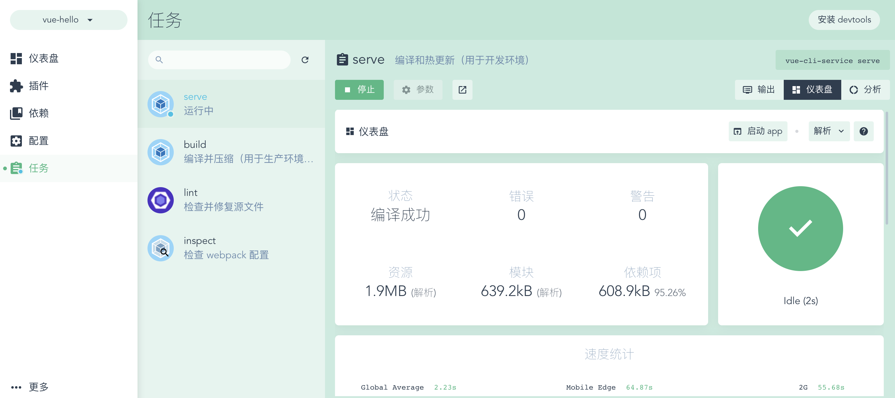

#$\color{red}{Vue}$
<!-- Vue -->
### Vue 简介
- 属于单页面应用（SPA）

#### 如何开始一个 vue 项目
- vue 开发的模式都是属于 node 项目开发模式，由于 vue 框架本身非常复杂，需要各种工具包，需要搭建一个 vue 的开发环境。但是手动搭建一个 vue 的开发环境非常难，但是官方提供了一个非常不错的脚手架（cli）

- 安装脚手架工具 cli 在命令行执行 `npm install -g @vue/cli` 全局脚手架工具

- 利用脚手架工具搭建 vue 项目
 - 直接使用命令搭建，在对应位置打开命令行工具，执行`vue create vue-hello` 命令创建项目，选择默认预设，然后直接回车即可
 - 使用图形化界面搭建（只有脚手架工具3.x以上版本才能使用），在对应位置打开命令行工具，执行 `vue ui` 命令，会在浏览器中自动弹出图形化界面，可以创建新的项目了
 - 运行已经创建好的项目，其实就是执行项目下的 package.json 文件内的 script 字段下的 serve 命令 `vue run serve` 这个命令执行完毕之后，默认的就会将 vue 的 demo 项目启动在本机（localhost）服务器下的 8080 端口，有冲突则会向下顺延端口
 - 图形化ui则是点击运行 -> 启动app
 

#### vue 项目默认的目录结构
- node_modules 所有的基础依赖，以后通过 npm 下载的所有的包也会放到这
- README.md 项目介绍文件
- package.json  node 项目标志性文件
- package-lock.json 项目安装的所有包的记录
- bable.config.js bable 的配置文件
- .gitignore 如果该项目是 git 仓库，那么 .gitignore 内声明的文件以及文件夹就不会上传到 git 该文件就是 git 仓库忽略上传的文件
- public 文件夹，里面放的是单页面应用的 html 模板
- src 文件夹 vue 项目源代码
 - assets 文件夹 可以放图片以及css
 - components 文件夹 存放组件的文件夹
 - App.vue
 - main.js 项目的入口文件

#### vue 的基础知识

##### 组件
- .vue后缀的就是 vue 组件，以后也会有其他形式的组件。组件其实就是一个 html 内的结构
- vue 组件的构成
  - template 标签
    - template 标签基本和以前的 html 非常像，但又不一样。 一个 template 内只能有一个子集
  - script 标签 
    - 一般必须默认导出一个对象，对象下有一个 name 属性，属性值和组件名一样
  - style 标签
    - 给组件写样式的

- App.vue 组件是项目最大的组件，因为只有 App 组件会被渲染到页面上的 #app 中

##### 组件的嵌套